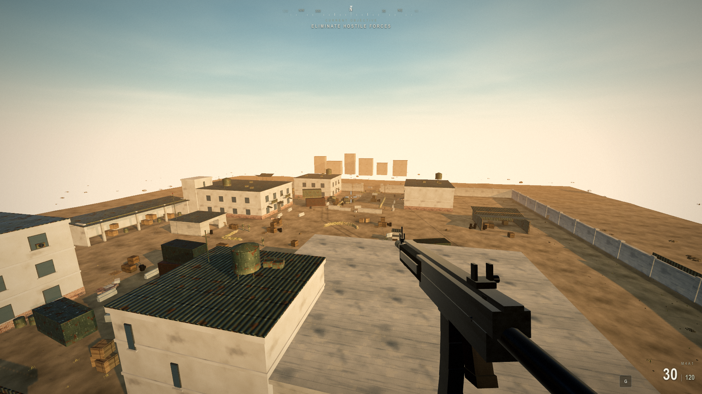
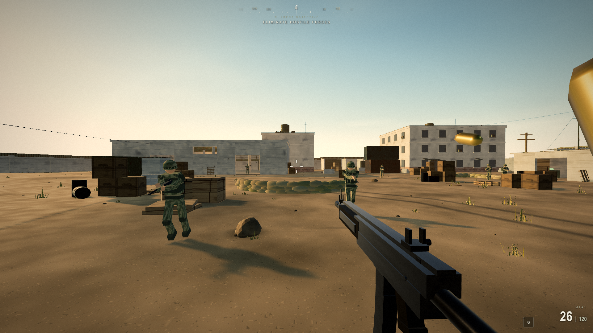
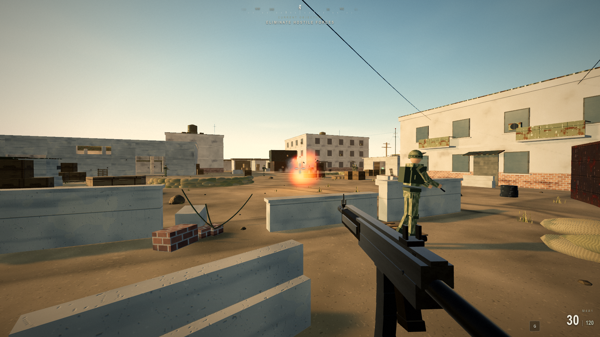
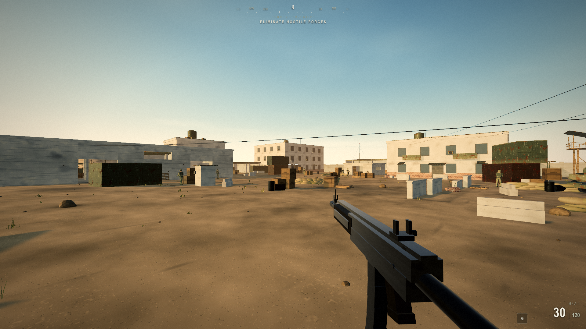
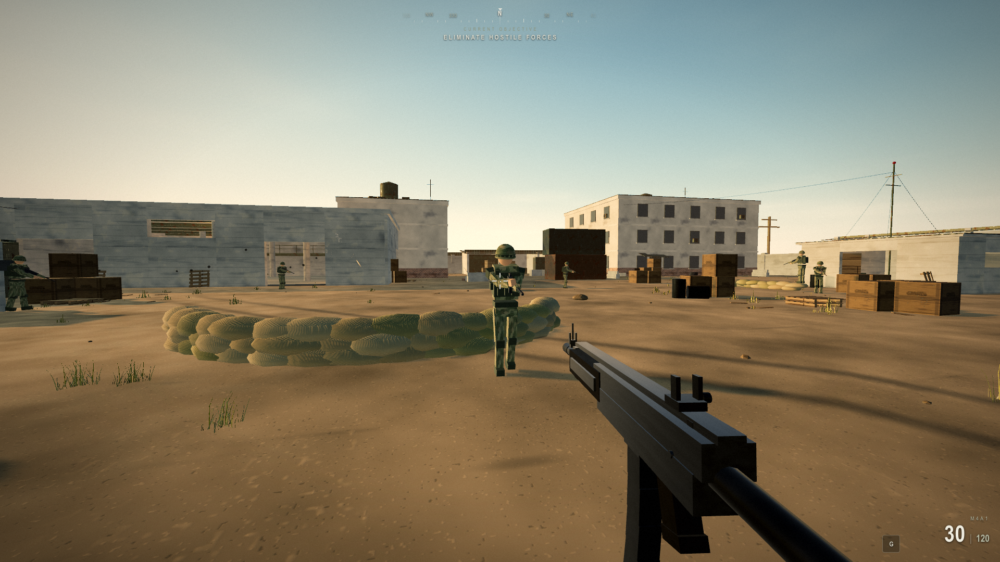

# STRIKE COMPOUND

A browser first-person shooter built to the visual bar of **Call of Duty: Modern Warfare (2019/II)** — golden-hour desert compound, physically-based materials, disciplined post-processing, pooled FX, and fully procedural soldiers. No game engine, no downloaded art assets: everything is generated in code and rendered with [Three.js](https://threejs.org/) in a plain browser tab.

> ### 🤖 Built end-to-end by Qwen
> **This entire game was written by Qwen3.8-max — autonomously.** No human wrote the gameplay, rendering, AI, FX, audio, or HUD code. Qwen architected the project as a set of isolated subsystems (see [`CONTRACT.md`](CONTRACT.md)), implemented each one, then graded its own output against real Call of Duty reference frames through an automated harsh-critic loop (see [`CRITIC.md`](CRITIC.md)) and iterated until the frames held up. The screenshots below are unedited captures from that run.

---

## Screenshots

_Unedited in-engine captures (Three.js, real-time, 1080p)._

| | |
|---|---|
|  |  |
| **Golden-hour compound** | **Combat POV** |
|  |  |
| **Pooled explosion FX** | **Sunset silhouette** |


**Procedural soldier — no imported meshes or textures**

---

## Quick start

```bash
npm install
npm run dev        # play at http://localhost:5173
```

Optimized build:

```bash
npm run build
npm run preview    # http://localhost:4173
```

Headless screenshot harness (used by the critic loop):

```bash
npm run capture -- --name myshot --pos 0,3,50 --look 0,2,0 --wait 1500
```

**Controls:** `WASD` move · mouse look · `LMB` fire · `RMB` ADS · `R` reload · `Shift` sprint · click to lock the pointer.

---

## What's in the box

- **Rendering** — Three.js with a physically-based pipeline, HDR-style tone mapping, bloom and post-FX tuned for a golden-hour desert look.
- **World** — a procedurally built desert compound: terrain, structures, props, and lighting generated from noise and code, no external models.
- **Weapons** — code-built gun meshes, viewmodel animation, hitscan weapon system, ADS.
- **AI** — procedural enemy soldiers with behavior, targeting, and hit reactions — geometry and materials assembled at runtime.
- **FX** — pooled particles, decals, tracers, muzzle flashes, and explosions (object pooling throughout to avoid per-frame allocation).
- **Audio** — a synthesized sound system (weapons, impacts, ambience) generated with the Web Audio API — no audio files.
- **HUD/UI** — ammo, crosshair, compass, kill feed, damage layer, and death screen styled after MW2019.

## Tech stack

| | |
|---|---|
| Rendering | Three.js `^0.185` |
| Build/dev | Vite `^8` |
| Screenshot harness | Puppeteer (headless capture for the critic loop) |
| Assets | **100% procedural** — geometry, textures, and audio all generated in code |

## How it was built

Qwen ran this as a small studio of specialized agents rather than one monolithic pass. The rules are codified in [`CONTRACT.md`](CONTRACT.md):

- **One agent per subsystem**, each writing only inside its own scope (`src/world`, `src/weapons`, `src/ai`, `src/fx`, `src/audio`, `src/ui`). Cross-scope imports are forbidden; every system talks through a shared `game` context.
- **A capture-and-critique QA loop** ([`CRITIC.md`](CRITIC.md)): render standardized frames, blind-A/B them against real Modern Warfare II reference shots, score each frame on lighting / materials / FX / animation / composition / UI / performance, produce a ranked, concrete fix list, and repeat. The `shots/round-N/` iterations are that loop running to convergence.

### Repository layout

```
src/
  core/      engine, input, post-processing
  player/    player controller
  world/     procedural level, lighting, props, textures, noise
  weapons/   gun builders, viewmodel, weapon system + defs
  ai/        enemy system, soldier builder, behavior, tracing
  fx/        decal / points / streak pools, effects, textures
  audio/     synth-based sound system
  ui/        HUD, ammo, crosshair, compass, kill feed, damage, death screen
tools/       headless capture + diagnostic scripts (Puppeteer)
media/       README screenshots
CONTRACT.md  subsystem ownership + architecture rules
CRITIC.md    automated harsh-critic QA protocol
```

## Credits

- **Game code, art direction, and iteration:** Qwen3.8-max (autonomous).
- Reference frames from Call of Duty: Modern Warfare II are property of Activision and are **not** included in this repository; they were used only as private grading targets during development.

## License

No license granted. Provided as a demonstration of what Qwen can build; not affiliated with or endorsed by Activision. "Call of Duty" and "Modern Warfare" are trademarks of Activision Publishing, Inc.
